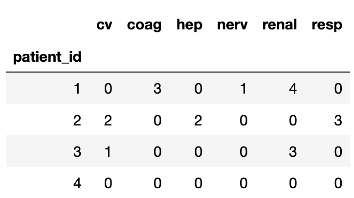
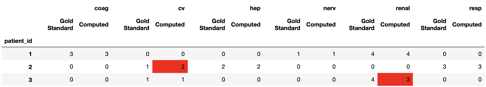

# Index Aligned Data Review Tool
This tool was developed for the specific use-case of quickly finding discrepancies between computer generated and human generated [SOFA](https://en.wikipedia.org/wiki/SOFA_score) scores.  Here, we describe the tooling we built to support that task as well as how we generalized it for use in any data comparison task.  SOFA is comprised of 6 sub-scores and 1 total composite score(sum of the 6 sub-scores).  Each sub-score is based on a constrained set of data that is commonly available in Electronic Medical Records(EMRs).  Our goal was to automate the extraction of these data and the subsequent calculation of the 6 SOFA sub-scores.  This tooling was used extensively during the development process to ensure that the computationally generated scores aligned with human derived scores.

## Testing process
Using EMR data, 3 physicians performed manual chart review and derived the 6 sub-scores.  The manually derived annotations from this process were captured in [RedCap](https://www.project-redcap.org).  Disagreements between the annotators were resolved via a voting process resulting in a gold standard dataset.  We also developed a computational approach to generate SOFA scores and executed it on the same patient set.  The computed annotations were save in a SQL(Oracle) database.  While stored in different systems, conceptually we now had 2 tables worth of data which shared the same index (patient identifier) and the same columnar content (6 SOFA sub-scores).

### Example Tables
Two tables - one computer generated, one manually generated.  Same index (patient_id) and same columns.  Can you quickly spot the differences in the data?

### Human Generated Table


### Computer Generated table


### Harmonized view
Even with only a few rows of data, it's easy to get lost in the sea of numbers.  We wanted a tool that would quickly highlight differences.

Much easier to spot the differences!


## The Tooling
Using open source Python tooling, Jupyter, Pandas, Numpy, scikit-learn, and nltk, this was a fairly trivial task.  Think of this tooling as part process, part function library, part recipe book that you can use/adapt for your own use-cases.  We broke down the process into 6 steps.  We built the code for each with modularity, re-use, and extensibility in mind.  Our specific use case has us comparing two sets of annotations against one another, however, you might have 10 sets of annotations that need comparison.  The steps are the same either way.  You will need spend time adapting this code, primarily at step 1, for your data.  Your task will be to load your data from whatever source you have into a set of Pandas DataFrames that share the same records and the same columns.  The rest should just work.
1. Read data into Pandas Dataframes
2. Ensure dataframes share the same columns.  Names must overlap!  Rename columns if necessary.
3. Add dataframes to a dictionary.  The key should name the source of the data, the value is the dataframe
4. Ensure Index Alignment (All frames have the same number of rows with intersecting index values)
5. Merge the Dataframes into 1
6. Compare Data
  - Visualize differences - aka 'Visual Grepping'
  - Quantify discordance
  - In the special case of adjudicating expert annotations: inter-rater agreement


### Reading Data - Step 1
Pandas and Python in general is adept at loading just about any data from any source.  Our SOFA use-case had us loading the  human annotated data from RedCap via an API which returns a JSON object.  This was easily digestible into a Pandas dataframe.  We loaded computer generated annotations from Oracle using the Pandas read_sql() function.  Once the data was in DataFrames, it was just following the rest of the steps.

In order to make it easy to follow the demo, we altered step 1 to run off csv files (in the data/ folder) so there is no need for RedCap and Oracle to experiment with the code.  

In the appendix section of the notebook we provide our original code to load from RedCap and Oracle as examples.  We also provide the XML necessary to create this project on your redcap instance and the SQL DDL to build the table in your oracle database.  See the Oracle and RedCap sections below for additional information.

### Step 2 - columnar alignment
Choose a set of columns you wish to compare and then make sure both dataframes have those columns.  This might require some renaming after your data is loaded from source.  In this demo, there is 1 column per SOFA component score.
```py
# define columns to compare
compareCols = ['cv','coag','hep','nerv','renal','resp']
# apply a filter to exclude columns not in this list
goldStandardDf = goldStandardDf.filter(compareCols)
computedDf = computedDf.filter(compareCols)
```

### Step 3 - Create Dataframe dictionary
Add the source dataframes to a dictionary with meaningful names
```py
dfDict = {
    'Gold Standard': goldStandardDf,
    'Computed':computedDf
}
```

### Step 4 - Align Indexes
Ensure all dataframes contain the same records aka rows aka index.  This is done by taking the intersection of all index values in the dataframes in dfDict(created in step 3) and excluding all records not in the common intersection.  The included function `alignIndexes(dfDict)` takes the dictionary of dataframes and returns a dictionary of index aligned dataframes.

### Step 5 - Merge all dataframes into 1
Puts all the data into a single dataframe - the representation used for visualizing the differences

### Step 6 - Compare the data
Either visualize or generate statistics describing the differences between the data sources.  At the time this notebook was originally released, these 3 comparisons are included with example code:
1. Visual diff - We used this to target specific differences quickly and perform root cause analysis
2. Percent discordance - rough metric to summarize larger tables (that cannot be visually grepped quickly)
3. Inter-rater agreement - Using the nltk.agreement.AnnotationTask() function.  This is used to measure strength of agreement between expert labelers.


#### Code base quickstart
We assume you have a working installation of [Jupyter](https://jupyter.org).  We also assume a working knowledge of python virtual environments, specifically [Pipenv](https://github.com/pypa/pipenv).  These instructions will help clone the code from GitHub on to your machine and build a jupyter kernel to run the examples in the notebook.

1. Navigate to your desired working directory
1. Clone repo.  Obtain clone link from [HERE](https://github.com/ucdavis-informatics/ucd-ri-datacompare)
1. cd into the new cloned directory - ucd-ri-datacompare
```bash
$ cd ucd-ri-datacompare
```
1. Initialize virtual environment
```bash
$ pipenv --three install
```
1. You are now ready to create the kernel for Jupyter
```bash
$ pipenv shell
$ python -m ipykernel install --user --name ucd-ri-datacompare --display-name ucd-ri-datacompare
```

## Using the Jupyter Notebook
Now that your kernel, named ucd-ri-datacompare, is created start jupyter and navigate to IndexAlignedDataValTool.ipynb.  Open it and select the ucd-ri-datacompare kernel.  

The notebook is arranged with the demonstration at the beginning.  Execute the cells in order from top to bottom to follow the demo.  At the bottom are Appendices containing code examples for other tasks such as:
- Interpreting Patterns in the visual diff
- Executing inter-rater agreeement using the nltk.agreement.AnnotationTask() function
- Working with alternative data sources
  - Oracle Database
  - RedCap via the RedCap API


### Oracle
The primary difference between obtaining data from Oracle and loading from a file is:
1. The need for a database connection
1. The need to use SQL to obtain the data rather that read_csv()

This requires a few additional dependencies:
1. Database client libraries.  This will vary based on the database in use.  For Oracle, see [HERE](https://www.oracle.com/database/technologies/instant-client/downloads.html)
1. Additional Python Packages
```bash
$ pipenv install cx_oracle sqlalchemy
```

We ship this with a table create statement in the resources folder if you happen to have a database to connect to and want to quickly test this approach.  You will need to either provide data or generate some fake examples.


### RedCap
We chose to use the RedCap API.  You could also run a report and generate a CSV file.  To follow our approach and use the API you will need these additional packages:
```bash
$ pipenv install pycurl
```
The amount of post processing you will need to do will vary based on how the RedCap project is arranged and will be project specific.  If you have redcap we shipped this with the XML necessary to re-create our project in your instance in the resources folder.  You will need to input some data for a workable example.  I suggest reviewing the RedCap API documentation and experimenting with their API playground.


##### Notes on Pycurl
pycurl can be problematic during virtual environment creation  
If you encounter problems, there are OS specific solutions:  
- Mac: [See Here](https://cscheng.info/2018/01/26/installing-pycurl-on-macos-high-sierra.html)
- Linux(Ubuntu):  Make sure the pre-reqs are in place first, then retry the pipenv install
```bash
$ sudo apt-get install libcurl4-gnutls-dev
$ sudo apt-get install libgnutls28-dev
```
- Windows: I'm sorry, I don't know
